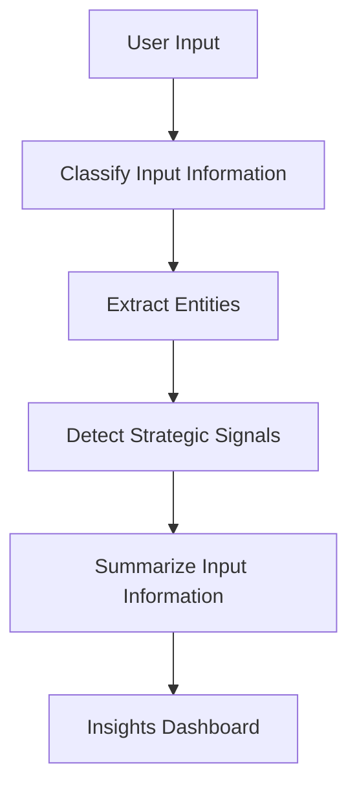

# StratVision-AI

StratVision-AI is an AI-powered application that helps in **analyzing input information**, **detecting strategic signals**, **extracting entities**, and **summarizing insights**.  
It is built with **Next.js, TypeScript, and Tailwind CSS**, and integrates AI-driven flows for intelligent decision support.

---

## 🚀 Features

- **Input Information Classification** – Categorizes and organizes incoming data.
- **Entity Extraction** – Identifies and extracts meaningful entities from text.
- **Strategic Signal Detection** – Detects important patterns or signals from input.
- **Summarization** – Generates concise insights from large content.
- **Modern Frontend** – Built with Next.js, TypeScript, Tailwind CSS for performance and usability.

---

## 📂 Project Structure

```
StratVision-Ai-main/
│── docs/                  # Documentation
│── src/
│   ├── ai/flows/          # AI flow definitions
│   │   ├── classify-input-information.ts
│   │   ├── detect-strategic-signals.ts
│   │   ├── extract-entities.ts
│   │   └── summarize-input-information.ts
│   ├── app/               # Next.js app structure
│   ├── components/        # Reusable UI components
│   └── ai/                # AI utilities
│── package.json           # Dependencies
│── next.config.ts         # Next.js configuration
│── tailwind.config.ts     # Tailwind CSS configuration
│── README.md              # Documentation
```

---

## 🛠️ Installation & Setup

1. **Clone the repository**
   ```bash
   git clone https://github.com/your-username/StratVision-Ai.git
   cd StratVision-Ai-main
   ```

2. **Install dependencies**
   ```bash
   npm install
   ```

3. **Run development server**
   ```bash
   npm run dev
   ```

4. Open in browser:
   ```
   http://localhost:3000
   ```

---

## ⚡ AI Flow Overview



- **User Input** – Raw text or information entered by user.  
- **Classify Input** – Categorizes data into meaningful groups.  
- **Extract Entities** – Pulls out keywords, names, organizations, dates, etc.  
- **Detect Signals** – Finds patterns or strategic triggers in data.  
- **Summarize Info** – Generates concise summaries.  
- **Insights Dashboard** – Displays final structured output to user.

---

## 📖 Documentation

- See [docs/blueprint.md](docs/blueprint.md) for the design blueprint.

---

## 🧑‍💻 Tech Stack

- **Frontend:** Next.js, TypeScript, Tailwind CSS  
- **AI/Logic:** Custom AI flows (`src/ai/flows/`)  
- **Deployment:** App Hosting with `apphosting.yaml`

---

## 📌 Roadmap

- [ ] Add more advanced entity recognition  
- [ ] Enhance signal detection with ML models  
- [ ] Improve visualization of insights  
- [ ] Integrate external APIs for real-time data  

---

## 🤝 Contributing

Contributions are welcome!  
1. Fork the repo  
2. Create a feature branch  
3. Submit a pull request  

---

## 📜 License

This project is licensed under the **MIT License**.
